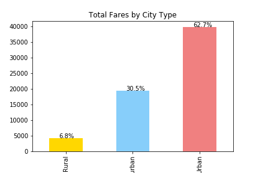
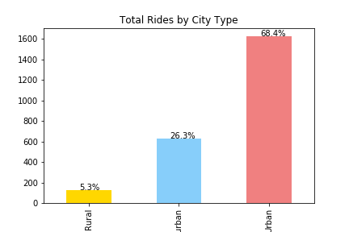
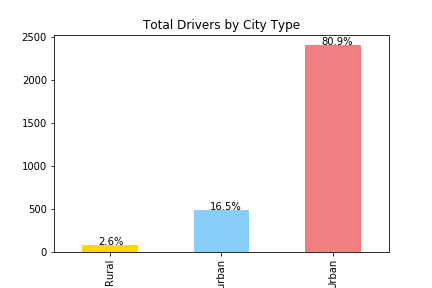
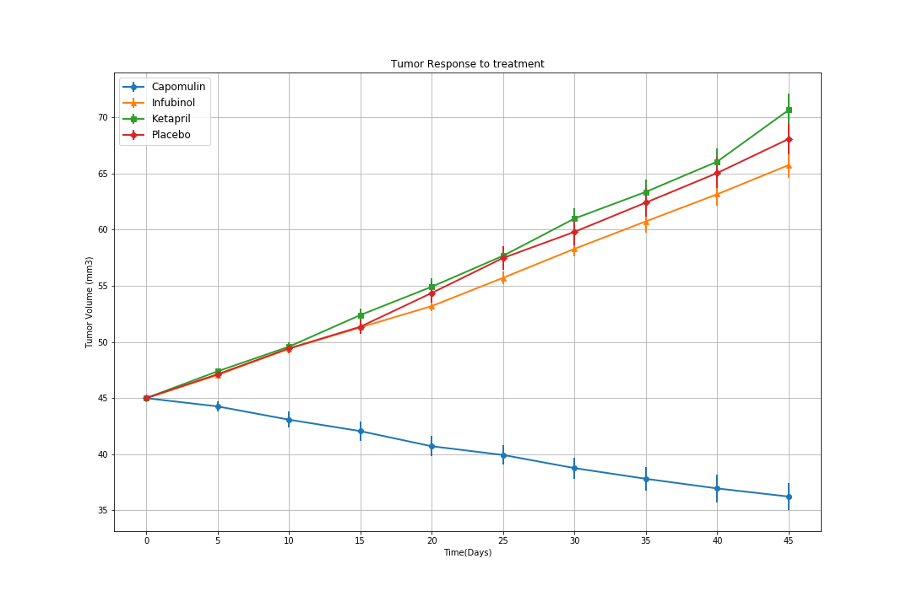
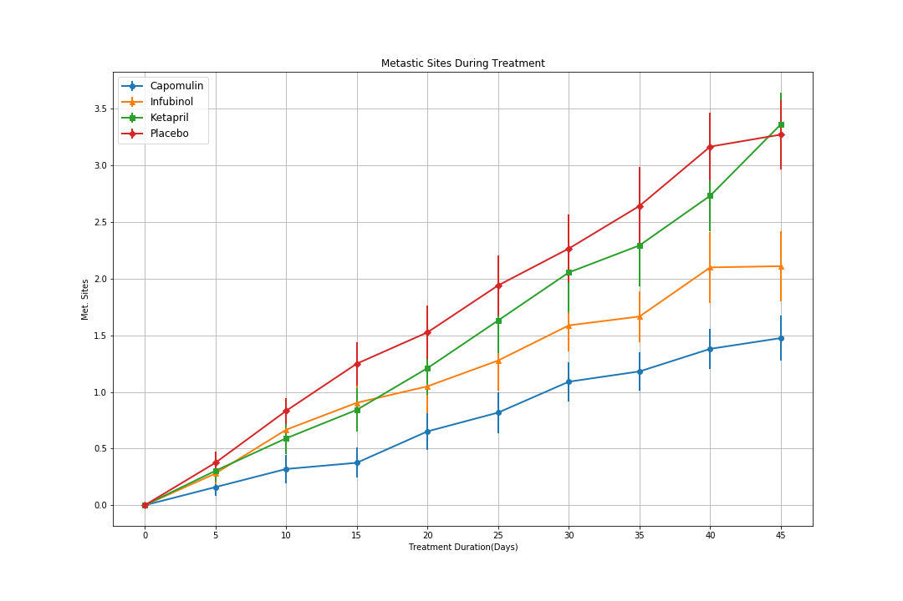
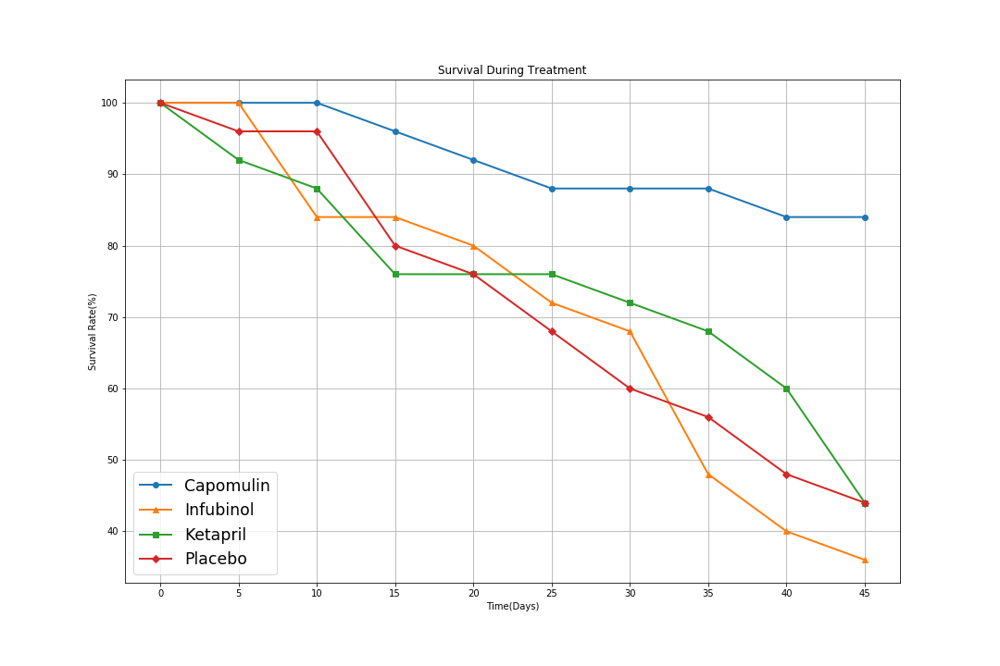
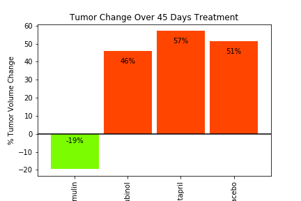

# Pyber Introduction

Pyber is in an exciting phase of seeking new opportunities. This report is intented to leverage historical data to aid in upcoming decisions.

# Overview of the Data

The dataset analyzed for this consists of  2,375 ride logs and a collection of city data where Pyber currently operates. Parameters include but are not limited to, driver count per city, city type and fare amounts.

# Methods

The Pandas library was used to merge, parse and aggregate the data and visualizations were created with the matplotlib library.

# Analysis

A bubble plot was created to show the relationship between the following four variables: average fare per city, total rides per city, total drivers in each city and city types. This was achieved by grouping by city and filtering by city type and setting the size by the driver count. Driver counts were pulled from the city data before it was combined to avoid counting drivers more than once.

Bar charts were then created to show the share per city type of total fares, revenue from fares and number of drivers

# Results of Analysis

The analysis of this dataset shows that urban cities are the main driver of revenue, representing 68% of revenue and 63% of fares. Additionally, urban areas have 80% of Pyber drivers for the analyzed period, outpacing both of the other ratios.

The bubble plot shows that rural areas are producing higher on average fares, the cause of which could be that drivers are typically taking longer trips when in those areas. The average fare for rural, suburban and urban areas is $35, $31 and $25 respectively.

There is a negative relationship between number of rides per city and average fare, this is seen across all city types but more defined in suburban and urban areas.

# Conclusions

This analysis suggests that Pyber should focus on expanding into urban and suburban areas over rural for the best chance of increasing revenue. Further study should be conducted to determine the optimum driver count per citizin in cities to prevent oversupply and driving down prices.
__________

# Pymaceutical Introduction

To aid in the effort of screening treatments for squamous cell carcinoma, this report is the analysis of the an animal study conducted on lab mice. For the purposes of this report four treatments were compared: Capomulin, Infubinol, Ketapril, and a Placebo.

# Overview of the Data

The data analyzed included a time measurement, tumor volume and metastic sites for a list of 250 mice that were treated with one of ten drugs.

# Methods

The Pandas library was used to merge, parse and aggregate the data and visualizations were created with the matplotlib library.

# Analysis

The first objective was to assemble a line chart with error bars showing how the tumors changed over the 45 days of treatment. This was done by grouping the data by drug and timepoint and calculating the mean and standard error tumor volumes. Before plotting the chart, the dataframes were unstacked and column names corrected with some minor data munging.

The next followed a similar process to the first, measuring the mean and standard error of metastic sites to produce a line chart with error bars.

The next chart shows survival of mice during treatment period by counting total of mice over time and converting to a percentage of starting count. This followed a similar process as the first two, but error bars are not included.

The last chart is a summary showing growth (positive or negative) of tumors being treated by the four compared treatments during the 45 day treatment period. This was achieved by calculating a percentage of change from the beginning to end of treatment and showing the values in a bar chart.

# Results of Analysis

Of the four treatments Capomulin produced the most favorable results, showing decrease in mean tumor volumes, least increase in metastatic sites and better survival rates than any of the other treatments.

Infubinol was shown to perform slightly better than the placebo but not in every instance, as the placebo had slightly better survival rates. While growth tumor growth and metastatic were lower in the Infubinol than the placebo with the lower survival rate the treatment is unlikely to be a promising treatment in the future without major revisions.

Ketapril seemed to be the least effective treatment of the four tested; results in mice treated with Ketapril were worse or equal to results in mice treated with the placebo.

# Conclusions

Further reproducable testing and peer review not withstanding, Capomulin appears to be the best treatment when measured by any of the metrics examined in this analysis. Further tests should be conducted in the near future.
