# Description of Data

For the purpose of practicing writing SQL queries to master the fundamentals, the sakila sample database was used for this exercise. Queries were written and executed inside the MySQL workbench.

An example of the tables and keys is below:

### actor
primary key:  actor_id

### address
primary key:  address_id

Foreign key: city_id

### film
Primary key: film_id

Foreign key: language_id

[Click here to view the sakila documentation on MySQL.com](https://dev.mysql.com/doc/sakila/en/)

## Limitations
Because this database features sample data some of the data is in a rather contrived format. This can be demonstrated with the below query. In a real life scenario it would be unlikely to observe 182 rentals recorded at the exact same moment. Because of the limitations of the rental dates the ability to do a robust time series analysis on rentals is not possible.
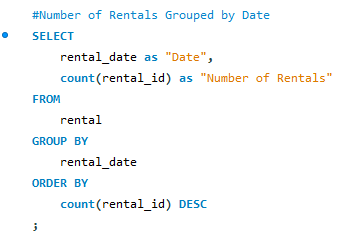

This is just an example of how this sample database will not behave exactly like real-word data and is not mean to be a criticism of sakila as it is effective as a practice tool for beginners in SQL. 

# Methodology
The use command is first executed to access the tables in the sakila database.

### Example 1
The first few practice questions are simple SELCT FROM statements with one CONCAT, UPPER & IFNULL example.

### Example 2
The second set of commands includes a WHERE = statement, two WHERE REGEXP examples and a WHERE IN statement used to filter results. ORDER BY is used to return results in the desired manner.

### Example 3
The third group of queries uses ALTER TABLE, ADD COLUMN and DROP COLUMN statements as well as demonstrating the blob data type.

### Example 4
The fourth block is utilized GROUP BY, COUNT & HAVING to again filter results as well as using SET to demonstrate a way to alter values in a table.

### Example 5
The fifth SQL code is an example of creating a schema in MySQL. Commands used include SHOW CREATE TABLE, CREATE TABLE IF NOT EXISTS, PRIMARY KEY, CONSTRAINT as well as others.

### Example 6
The sixth collection of SQL requests used JOINS, MONTHS and YEARS to demonstrate pulling data from multiple tables into one result as well as SUM to find revenue.

### Example 7
In the seventh example are code snippets that demonstrate using subqueries to filter and retrieve a desired result. This example does not introduce SQL commands not previously used but includes WHERE REGEXP and WHERE IN.

### Example 8
The final few questions are an example of a fairly complicated JOIN, GROUP BY, ORDER BY & LIMIT query as well as indicating a way to save a query with CREATE VIEW for effortless refreshing of the information.

# Results
### Example 1
First and last names from actor table.

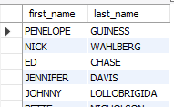

First and last names from actor table put into one column and named “Actor Name.”

### Example 2
Results from actor table with first name Joe.

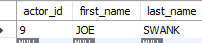

Actor ID, first name and last name from actor table for actors with GEN in their last name.

Actor ID, first name and last name from actor table for actors with LI in their last name; the result is sorted alphabetically.

Country ID and country name results from the country table for the countries Afghanistan, Bangladesh, and China.

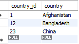

### Example 3
This group does not have a result table, so the action output is shown instead.

### Example 4
Last name from actor table with count of actors with each name.

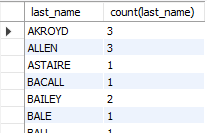

Same as prior example, but only including last names that are shared by at least two actors.

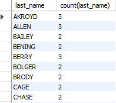

Action output for updating values in a table is shown below.

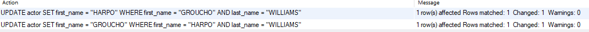

### Example 5
Describe result for address table is below.

### Example 6
First name, last name and addresses of staff members, taken from staff and address tables.

Revenue by staff member, taken from staff and payment tables.

Number of actors that appear in each movie, taken from film and film_actor tables.

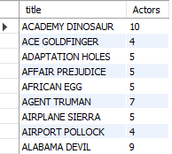

Copies of  film “Hunchback Impossible” in inventory, taken from film and inventory tables.

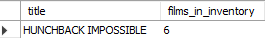

Amount paid by each customer, sorted alphabetically by last name, taken from customer and payment tables.

### Example 7
Films in English that begin with the letter K or Q, taken from film and language tables.

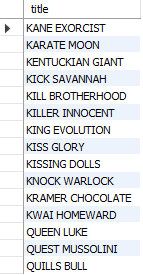

Actors that appear in the film “Alone Trip”, taken from actor, film_actor and film tables.

First name, last name and email address of customers located in Canada, taken from customer, address, city and country tables.

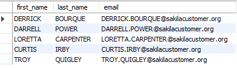

Films in the family category, taken from the film, film_category and category tables.

Most frequently rented films in descending order, both the top and bottom of result. Information retrieved from film, inventory
and rental tables.

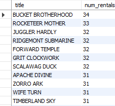

Revenue per store, taken from store, inventory, rental and payment tables.

Store ID, city and country for each store, taken from the store, address, city and country tables.

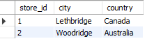

### Example 8
Top five genres by revenue, taken from category, film_category, inventory, rental and payment tables.

Action output for saving and deleting view is shown below

# Conclusions
It can be observed that the two stores in this sample data are bringing in almost identical revenue and as they are in different countries for this hypothetical example there is a lot of opportunity to grow into different countries or districts within the same countries.

“Bucket Brotherhood” was rented the most times, so it would be beneficial to have more in inventory if there have been stockouts and movies similar to it should be the target for purchases of new releases. Conversely, the films with low rentals numbers would likely be more beneficial to be sold as used items rather than taking up rack space in the stores.

# Future Analysis
Analyzing the results of amount spent by customers and sorting by revenue rather that customer name would yield a beneficial list to target for promotions or possibly even a monthly membership. Including the contact information for those customers would be necessary for any kind of outreach.

By joining the actor, film and film tables with revenue from payment table could produce a list of actors that are frequently appearing in films that bring in higher revenue than average.
