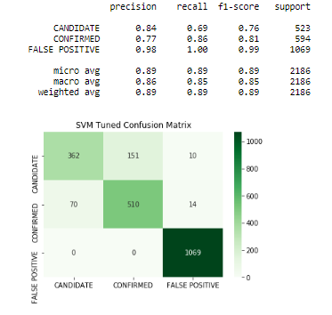
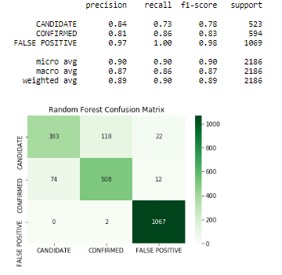
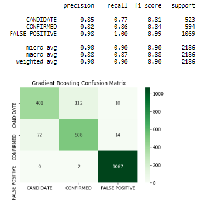

# Exoplanet Exploration

## Background

[Exoplanet Data Source](https://www.kaggle.com/nasa/kepler-exoplanet-search-results)

Over a period of nine years in deep space, the NASA Kepler space telescope has been out on a planet-hunting mission to discover hidden planets outside of our solar system. This project will examine the raw data and experiment with different machine learning models to find the best predictors. The data was preprocessed, scaled and then classified by one of three labels: "Candidate", "Confirmed" and "False Positive."

## Methodology

The data was preprocessed by removing unnecessary columns and null rows, leaving a total of 8744 observations with which to create a machine learning model. The data was then scaled with MinMaxScaler and separated into training and testing data.

An overview analysis suggested that there is not a strong correlation between the labels and any one or even several features, rather the 48 features must be taken together for the dataset to be able to correctly classify the observations. (See PCA notebook for more detail)

#### The first algorithm used was Support Vector Machine (SVM) from the SKLearn python library. Grid search was then used to hyper tune the C and gamma parameters to improve predictions. The reports produced are below.

 

#### The Random Forest and Gradient Boosting algorithms were an improvement on the SVM model.

 

#### Two Further algorithms used for this dataset were Naive Bayes and K Neighbors though neither were found to have favorable results.

 

## Results

The false positive was the most consistently correctly labeled of the three targets, therefore the ability of the models to distinguish between the candidate and confirmed labeled offers the greatest distinction. 

The first SVM model resulted in an 83% score on the testing data, with the most errors being candidate being mislabeled as confirmed. The tuned SVM model performed better overall and increased the test score to 89%, reducing the said errors from 222 to 151.

The Random Forest model performed very similarly to the second SVM model, again improving the candidate labeled as confirmed to a total of 118, but increasing by a slight amount the confirmed mislabeled as candidate. A gradient boosting model improved on these numbers even more and produced the best test score of any model at 90%.

As previously noted, Naïve Bayes and K Neighbors were not shown to be good models for this dataset, producing test scores of 75% and 81% respectively.
