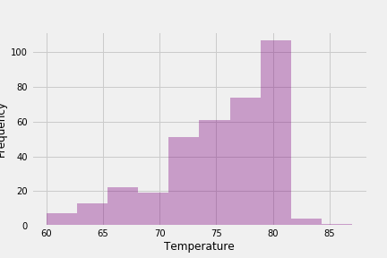
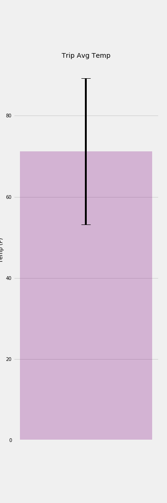
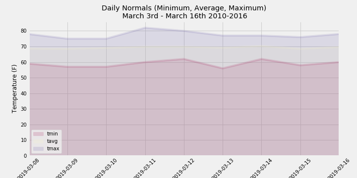

# Introduction

This project uses historical weather data for Hawaii to build an app that is useful for researching the best days to travel to hawaii.

# Overview of the Data

 The data used for this project includes a CSV file with a list of stations and a list of measurements.
 
 Measurement parameters includes:
 
 station: Identifing number of the station
 
 date: Date of recording
 
 prcp: A measurement of precipitation taken by the station
 
 tobs: A measurement of temperature taken by the station
 
 Station parameters includes:
 
 station: Identifing number of the station ex:USC00519397
 
 name: Name of the station ex: WAIKIKI 717.2, HI US
 
 latitude: latitude of station
 
 longitude: longitude of station
 
 elevation: elevation of station 

## Limitations of the Data

That data contained in the csv files is dated from January 1, 2010 to August 23, 2017 so at the time of this writing is missing almost two years of weather data. Because global temperatures have been observed to have an upward trend, any query based on normalized temperature for a particular can be expected to be lower than what will actually occur.

# Methods

The data is stored using SQLite, queried using SQLAlchemy and written into a delployable app using flask.

# Analysis

To prepare the queries for the app as well as to better understand the data, the below analysis was conducted.

Using the last date in the available data, the last twelve months of data in the database is queried, placed into a pandas dataframe and plotted in a bar chart using matplotlib to show total daily precipitation.

## Daily Precipitation over last year of data

Using the station with the most observations in the last twelve months of the data, temperatures are queried and plotted into a histogram.

## Temperature Histogram

Selecting a date range for a trip taken to Hawaii, minimum, average and maximum temperatures for that date range are queried and placed into a bar graph with an error bar.

## Trip average temperature

Again using a date range for a trip, the average daily norms are queried and plotted into an area graph.

## Trip temperature area chart

# Flask Routes

The flask routes prepared are detailed below:

/

Home page listing all available routes.

/api/v1.0/precipitation

Returns a JSON representation of the dates and total recorded precipitation.

/api/v1.0/stations

Returns a JSON list of stations from the dataset.

/api/v1.0/tobs

Returns a JSON list of Temperature Observations (tobs) from a year from the last data point.

/api/v1.0/<start> and /api/v1.0/<start>/<end>

Returns a JSON list of the minimum temperature, the average temperature, and the max temperature for a given start or start-end range.
When given the start only, calculate TMIN, TAVG, and TMAX for all dates greater than and equal to the start date.
When given the start and the end date, calculate the TMIN, TAVG, and TMAX for dates between the start and end date inclusive.

