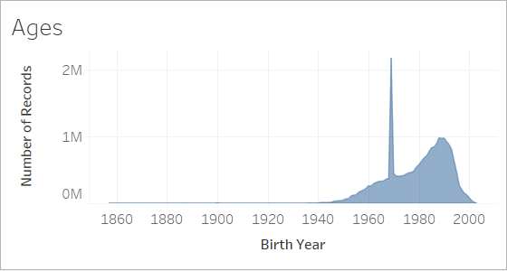
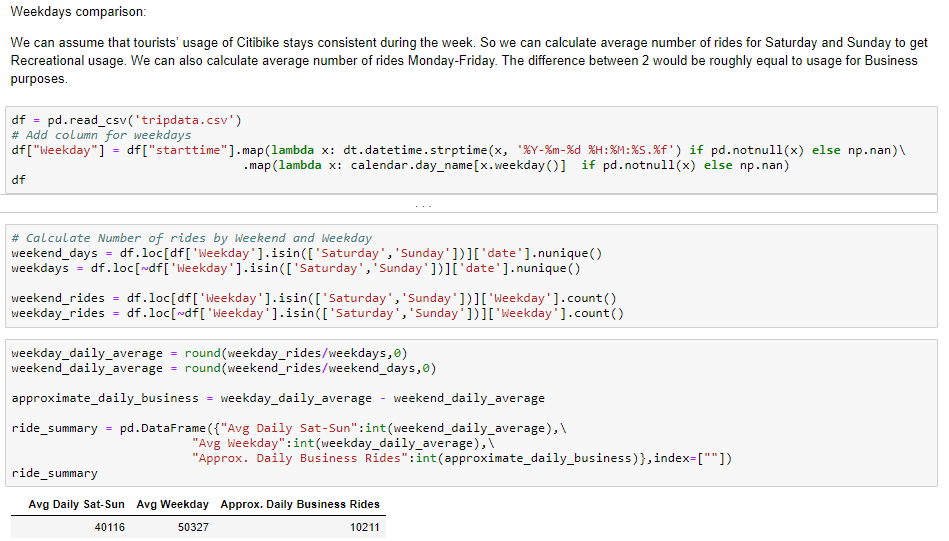
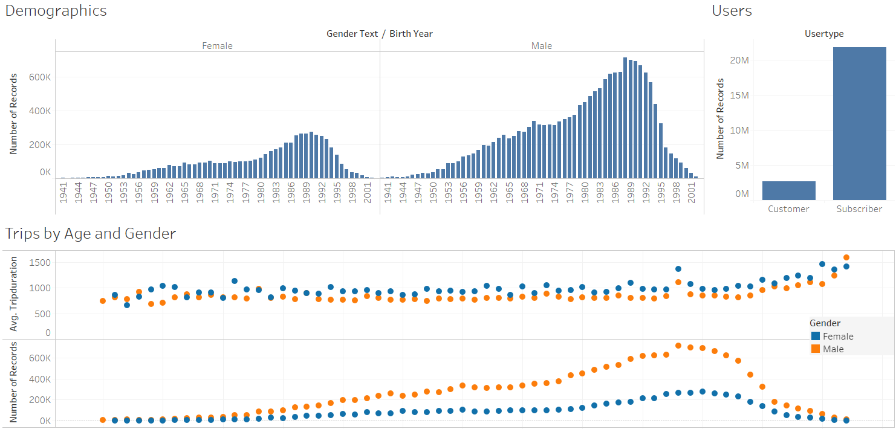

# Introduction

The purpose of this report is to visualize historic rental bike data in New York City in order to search for trends that can lead to actionable insights. In a large city such as New York a diverse array of transportation options will always be necessary to serve the population and keep traffic congestion to a minimum. Bike rentals are one option of many and should be encouraged because of the availability of bike lanes and the benefit of being an environmentally friendly selection.

[The Tableau story can be viewed by clicking here (A login to Tableau public may be required)](https://prod-useast-a.online.tableau.com/t/bethanylindberg/views/Citibike/CitiBikeStory)

# Overview of the Data

The citibike data was downloaded from [here](https://www.citibikenyc.com/system-data). For this analysis the time period chosen is January 2018 to June 2019. Parameters are listed below.

### Trip Data:

Tripduration: integer representing total length of trip in minutes

Starttime: Start of trip date and time e.g. 1/24/2018 7:31:33 PM

Stoptime: Stop of trip date and time e.g. Stoptime1/24/2018 7:41:08 PM

Start Station Id

Start Station Name

Start Station Latitude

Start Station Longitude

End Station Id

End Station Name

End Station Latitude

End Station Longitude

Bikeid

Usertype: User type for this trip (Customer or Subscriber)

Birth Year: User birth year if known

Gender: Integer code for gender

Date: Date of trip

Gender Text: Gender string

### Daily Ridership:

Date

Trips over the past 24-hours (midnight to 11:59pm)

Miles traveled today (midnight to 11:59 pm)

Total Annual Members (All Time)

New Members: Difference between prior day numbers and current entry

24-Hour Passes Purchased (midnight to 11:59 pm)

3-Day Passes Purchased (midnight to 11:59 pm)

Total Passes Purchased: Sum of 24-hour and 3-day passes purchase

### Weather:

Precipitation and temperature data was downloaded from [here](http://www.cnyweather.com/wxraindetail.php?year=2019). Parameters collected included daily accumulated precipitation in inches and daily high and low temperatures in Fahrenheit.

## Limitations of the Data

As shown in the below area graph, there is an unusual spike of birth years listed at 1969 and several records for every year between 1857 and 1939. These years were filtered out of the demographic analysis.

# Methods

The below aggregation was done in Jupyter Notebooks with Python and Pandas to estimate how many rides are taken for business purposes.

For explanatory analysis the below graphs were produced in Tableau.

## Demographics

## Peak

Tableau was also used to produce two sets of maps.

## Static

Annotated map showing trips over the entire dataset

## Dynamic 

Map showing each day of data set

